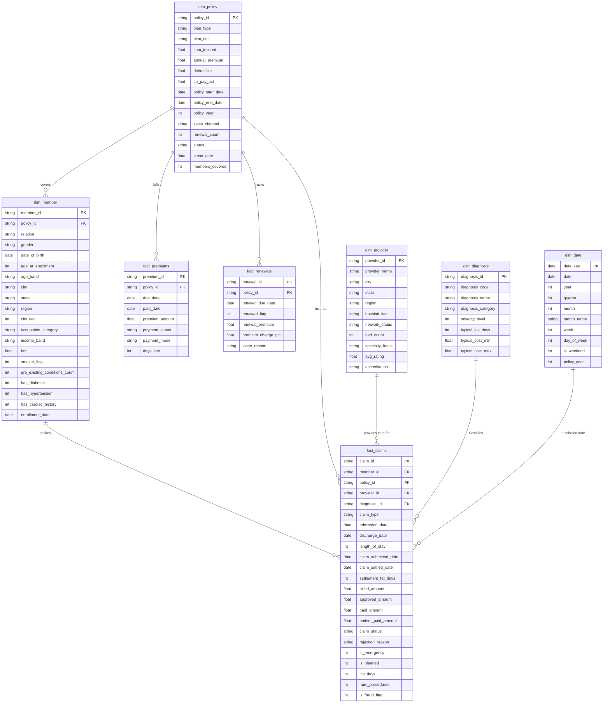

# MediSure Health Insurance Analytics - Entity Relationship Diagram

The warehouse follows a star-schema style data model optimized for insurance analytical queries and reporting.

```mermaid
erDiagram
    dim_member ||--o{ fact_claims : "makes"
    dim_policy ||--o{ dim_member : "covers"
    dim_policy ||--o{ fact_claims : "insures"
    dim_policy ||--o{ fact_premiums : "bills"
    dim_policy ||--o{ fact_renewals : "tracks"
    dim_provider ||--o{ fact_claims : "provides care for"
    dim_diagnosis ||--o{ fact_claims : "classifies"
    dim_date ||--o{ fact_claims : "admission date"

    dim_member {
        string member_id PK
        string policy_id FK
        string relation
        string gender
        date date_of_birth
        int age_at_enrollment
        string age_band
        string city
        string state
        string region
        int city_tier
        string occupation_category
        string income_band
        float bmi
        int smoker_flag
        int pre_existing_conditions_count
        int has_diabetes
        int has_hypertension
        int has_cardiac_history
        date enrollment_date
    }

    dim_policy {
        string policy_id PK
        string plan_type
        string plan_tier
        float sum_insured
        float annual_premium
        float deductible
        float co_pay_pct
        date policy_start_date
        date policy_end_date
        int policy_year
        string sales_channel
        int renewal_count
        string status
        date lapse_date
        int members_covered
    }

    dim_provider {
        string provider_id PK
        string provider_name
        string city
        string state
        string region
        string hospital_tier
        string network_status
        int bed_count
        string specialty_focus
        float avg_rating
        string accreditation
    }

    dim_diagnosis {
        string diagnosis_id PK
        string diagnosis_code
        string diagnosis_name
        string diagnosis_category
        int severity_level
        int typical_los_days
        float typical_cost_min
        float typical_cost_max
    }

    dim_date {
        date date_key PK
        date date
        int year
        int quarter
        int month
        string month_name
        int week
        int day_of_week
        int is_weekend
        int policy_year
    }

    fact_claims {
        string claim_id PK
        string member_id FK
        string policy_id FK
        string provider_id FK
        string diagnosis_id FK
        string claim_type
        date admission_date
        date discharge_date
        int length_of_stay
        date claim_submitted_date
        date claim_settled_date
        int settlement_tat_days
        float billed_amount
        float approved_amount
        float paid_amount
        float patient_paid_amount
        string claim_status
        string rejection_reason
        int is_emergency
        int is_planned
        int icu_days
        int num_procedures
        int is_fraud_flag
    }

    fact_premiums {
        string premium_id PK
        string policy_id FK
        date due_date
        date paid_date
        float premium_amount
        string payment_status
        string payment_mode
        int days_late
    }

    fact_renewals {
        string renewal_id PK
        string policy_id FK
        date renewal_due_date
        int renewed_flag
        float renewal_premium
        float premium_change_pct
        string lapse_reason
    }
```

